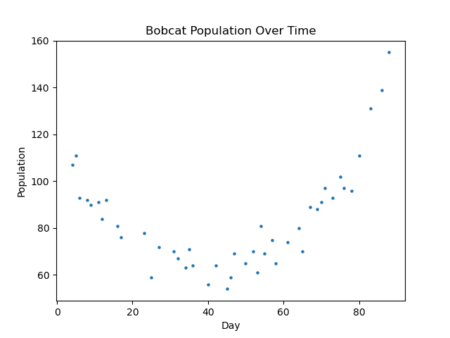
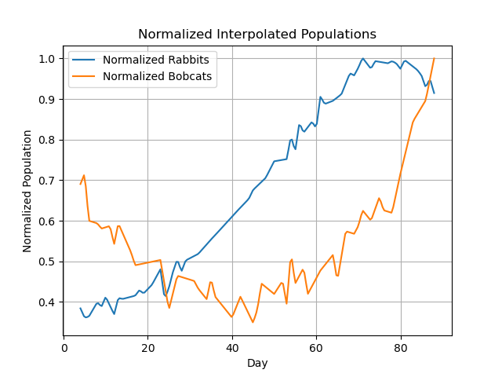

# Modeling Ecologolical Time Series Population Using ODEs

## Overview:

This project was created for the **Applied Mathematics Challenge 2025** at the University of California, Merced. It tackles an ecological modeling problem posed by the Department of Wildlife: **predicting the bobcat population over the next 90 days** based on observed sightings of bobcats and their primary prey — cottontail rabbits.

The modeling is performed using a **Lotka-Volterra predator-prey system**, implemented as a system of ODEs. We use real data, interpolation, parameter estimation via optimization, and simulate future dynamics to determine whether **wildlife control measures** may be necessary.

---

## Background:

Bobcats are elusive creatures, and it's difficult to track their population accurately through direct observation. However, by analyzing the population trends of both bobcats and cottontail rabbits (their primary prey), we can estimate how their interactions impact population dynamics.

### Challenge Objective:
> Predict the bobcat population for the next **90 days** based on sparse observational data.  
> If the population is projected to exceed **200**, wildlife control may be required.

---

## Mathematical Model

We used the **Lotka-Volterra equations**, a classic predator-prey system [Link](https://en.wikipedia.org/wiki/Lotka%E2%80%93Volterra_equations):

dx/dt = ax - bxy
dy/dt = dxy - cy

Where:
- \( x(t) \): Rabbit population at time \( t \)
- \( y(t) \): Bobcat population at time \( t \)
- \( a \): Natural growth rate of rabbits
- \( b \): Predation rate of bobcats on rabbits
- \( c \): Natural death rate of bobcats
- \( d \): Growth rate of bobcats per rabbit consumed

---

## Methodology

1. **Data Preprocessing**
   - Load observed sightings of rabbits and bobcats
   - Interpolate the data onto a common time grid
   - Normalize both datasets to eliminate scale bias

2. **Model Fitting**
   - Use `scipy.optimize.minimize` to fit Lotka-Volterra parameters via least-squares (MSE)
   - Simulate the system using `scipy.integrate.solve_ivp`

3. **Prediction**
   - Simulate 90 days into the future
   - Determine whether the bobcat population exceeds the threshold of 200

4. **Visualization**
   - Generate plots for original data, interpolated data, and population forecasts

## Visualizations: 

### 🐇 Rabbit Population Over Time

### 🐾 Bobcat Population Over Time

### 📈 Normalized Interpolated Populations

### 🔮 Predicted Populations (180-Day Forecast)

---